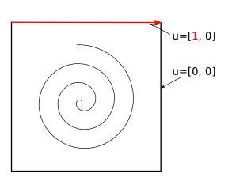

User guide
==========

The following is a quick introduction to setting up an Ocellaris simulation.
Note that many (MANY) possible simulations can be set up that Ocellaris will
fail to solve properly. You must validate the code for your own purposes before
trusting the results.

.. contents:: :local:

Installing Ocellaris
--------------------

Ocellaris is a Python package and it contains no modules that must be compiled
before running. Before running Ocellaris you must ensure that the ocellaris
Python package is in the Python search path. This can be done by installing
the package directory to a ``site-packages`` directory that is already in the
Python search path, or setting the ``PYTHONPATH`` environmental variable to
contain the directory where the ``ocellaris`` Python package is found (a Python
package == directory containing an ``__init__.py`` file).

You must also ensure that FEniCS is installed. If you can run ``import ocellaris``
inside Python then Ocellaris should be working..

Ocellaris will eventually be available on PYPI for installarion through the
``pip``, command but currently you must download the package manually from 
`the Ocellaris Bitbucket <https://bitbucket.org/trlandet/ocellaris/src>`_.

Running Ocellaris
-----------------

Ocellaris is typically run from the command line with the name of an input file
as the first argument:

.. code-block:: sh

    python -m ocellaris taylor-green.inp
    
You can optionally override parameters given on the input file:

.. code-block:: sh

    python -m ocellaris taylor-green.inp \
        --set-input time/dt=0.1 \
        --set-input 'solver/velocity_function_space="CG"'  

You can see a summary of the command line options by running:

.. code-block:: sh

    python -m ocellaris --help
    
Ocellaris will normally create a log file with the information that is also 
shown on screen. This will contain a listing of the input after modification
by the ``--set-input`` command line flag so that you can be sure to know
exactly what you did run when you look back on an old simulation.

Tutorial on creating an input file
----------------------------------

To run Ocellaris you must create an input file. The Ocellaris input file is on
YAML format and allows you to control most of the solution process. The
different sections of the input file are described below. 

Note that since JSON is a valid subset of YAML you can also specify the input
file in JSON format. JSON has no easy support for multi-line strings and
comments, so YAML is the format used by the Ocellaris demos and also in the
descriptions below.

Gotchas
.......

Some errors that are easy to make when writing a YAML input file:

- Boleans in YAML are written all lower case  (:code:`true, false`) unlike
  in Python where the first letter is upper case (:code:`True, False`).
- The value ``5e-3`` is a string in YAML while ``5.0e-3`` is a float.
- Indentation is significant, just like in Python

The example simulation
......................

This document describes how to make an input file for Ocellaris. The example
simulation that is created through the tutorial is the well known lid driven
cavity flow problem in 2D. An input file for this simulation is used in most
examples. Input options not used for a 2D lid driven cavity simulation are
also mentioned and (mostly) complete lists of options are given in tables. 

    Lid driven cavity

For the example simulation the domain is a 2D unit square with no-slip
conditions on three walls and a constant horisontal velocity equal to 1.0 on
the top. The Reynold's number is given by the kinematic viscosity. We will use
:code:`nu = 0.001` which gives a Reynold's number of 1000.

Header
......

The input file must start with the following header:

.. code-block:: yaml

    ocellaris:
        type: input
        version: 1.0

You can optionally specify some metadata if you feel like it. This is not
required, but can be useful for explainations and later references. We are
making an input file for the lid driven cavity test case, so we write a
short description of what we will be calculating.

.. code-block:: yaml

    metadata:
        author: Tormod Landet
        date: 2015-02-13
        description: |
            Implements the lid driven cavity flow test case. This benchmark case
            has no analytical solution, but is a nice way to test the solver in
            presence of viscous shear and discontinuities.
            
            Comparison data is included. This is from the paper by V. Ghia, 
            K.N. Ghia and C.T. Shin: "High-Re solutions for incompressible flow
            using the Navier-Stokes equations and a multi-grid method" in 
            J.Comp.Phys., v.48, 1982, pp.387-411. 

Here you also see the syntax for multi-line strings in YAML.

Physical properties
...................

You will need to specify some physical constants. 

.. code-block:: yaml

    physical_properties:
        g: [0, 0]
        nu0: 0.001
        rho0: 1.0

The postfix ``0`` is there to  allow for more than one fluid in one simulation.
The in a two fluid flow simulation the second fluid will use postfix ``1``.

.. csv-table::
   :header: "key", "Default value", "Description"

    "physical_properties/g", "[0]*ndim", "The acceleration of gravity"
    "physical_properties/nuX", "**required input**", "The kinematic viscosity of fluid X"
    "physical_properties/rhoX", "1.0", "The density of fluid X (required for multi-phase calculations, optional for single phase)"

Multi phase model
.................

If you are creating a two fluid simulation you will have to specify some
parameters of the multi-phase solver. For the lid driven cavity we can leave
the multi phase solver specification out of the input file. The default value 
of this section is:

.. code-block:: yaml

    multiphase_solver:
        type: SinglePhase

When using the multi phase VOF solver by specifying :code:`type: BlendedAlgebraicVOF`
the following parameters can be specified:

.. csv-table::
   :header: "key", "Default value", "Description"

    "multiphase_solver/function_space_colour", "DG", "CG for continuous Galerkin, DG for discontinuous Galerkin"
    "multiphase_solver/polynomial_degree_colour", "0", "The degree of the approximating polynomials"

In addition you will have to specify a convection scheme for the VOF colour
function in order to keep the free surface sharp. For specifying the convection
scheme, see below.

Mesh
....

You need to load or create a mesh. Currently you can create 2D rectangle meshes
or load a mesh (2D or 3D) from a FEniCS mesh on xml format. For our test case
we create a default size square 2D domain with 64 elements along each side.

.. code-block:: yaml
        
    mesh:
        type: Rectangle
        Nx: 64
        Ny: 64

The following parameters can be specfied when creating a rectangular mesh:

.. csv-table::
   :header: "key", "Default value", "Description"

    "mesh/type", "**required input**", "What type of mesh to create/load. ``Rectangle`` or ``XML``"
    "mesh/Nx", "**required input**", "The number of elements in the x-direction"
    "mesh/Ny", "**required input**", "The number of elements in the y-direction"
    "mesh/startx", "0.0", "The position of the left hand side of the mesh"
    "mesh/endx", "1.0", "The position of the right hand side of the mesh"
    "mesh/starty", "0.0", "The position of the bottom of the mesh"
    "mesh/endy", "1.0", "The position of the top of the mesh"

If you select to load the mesh from a FEniCS XML mesh file you can must specify the following:

.. csv-table::
   :header: "key", "Default value", "Description"

    "mesh/mesh_file", "**required input**", "Name of the XML file containing the mesh"
    "mesh/facet_region_file", "None (not required)", "Name of the XML file containing boundary region markers. You can use this to prescribe boundary conditions on regions created in the mesh tool (e.g Gmsh *physical lines*)"

Ocellaris will look for the xml files first as absolute paths, then as paths
relative to the current working directory and last as paths relative to the
directory of the input file. If it cannot find the file in any of these
places you will get an error message and Ocellaris will quit.

A sample mesh xml file and facet marker file is included in the ``demo/files``
directory. The mesh ``ocellaris_mesh.xml.gz`` and the facet regions
``ocellaris_facet_regions.xml.gz``. You can load these files without unzipping
them. The *flow around Ocellaris* demo shows how it is done.

Boundary conditions
...................

You need a list of boundary conditions for your problem. For each region of the
boundary you first need to tell Ocellaris how to find this region and then the
boundary conditions to apply to each of the variables (velocity and pressure for
a single phase simulation).

You can select constant Dirichlet boundary conditions (``ConstantValue``) or
constant Neumann conditions (``ConstantGradient``). You can also have coded
boundary conditions where you give a source code snippet that is executed to
calculate the boundary condition value, either in Python (type ``CodedValue``)
or in C++ (type ``CppCodedValue``). 

How to mark different areas of the boundary is explained below. For the lid
driven cavity the boundary conditions are as follows:

.. code-block:: yaml
                
    boundary_conditions:
    -   name: walls    
        selector: code
        inside_code: on_boundary
        u:
            type: ConstantValue
            value: [0, 0]
        p:
            type: ConstantGradient
            value: 0
    -   name: lid
        selector: code
        inside_code: on_boundary and x[1] >= 1.0 - 1e-8
        u:
            type: ConstantValue
            value: [1, 0]
        p:
            type: ConstantGradient
            value: 0

Note that the ``-`` in front of the ``name: ...`` lines marks the start of a
list item. The boundary conditions should be given as a list of boundary
regions. Each region specifies boundary conditions for all variables on the
selected boundary. 

The boundary conditions for the velocity components can also be broken up and
written per component. This allows you to apply different boundary conditions
types for each component. In this case it can be written (for the lid):
 
.. code-block:: yaml
    
    u0:
        type: ConstantValue
        value: 1
    u1:
        type: ConstantValue
        value: 0

Available options 
~~~~~~~~~~~~~~~~~

.. csv-table::
   :header: "key", "Default value", "Description"

    "boundary_conditions/[i]/name", "**required input**", "The name of the region. For more helpful error messages etc."
    "boundary_conditions/[i]/selector", "**required input**", "How the region is selected. Supported methods are ``code`` and ``mesh_facet_region``."
    "boundary_conditions/[i]/inside_code", "**required** when the selector is ``code``", "Python code to mark facets as inside the region or not"
    "boundary_conditions/[i]/mesh_facet_regions", "**required** when the selector is ``mesh_facet_region``", "List of identificator numbers of the facet regions from the mesh. See below."
    "boundary_conditions/[i]/map_code", "**required** when using periodic boundary conditions", "Code for mappinc coordinates when using periodic boundary conditions. See below."
    "boundary_conditions/[i]/var_name", "", "Boundary conditions for var_name. See below."

The boundary condition for each variable is given in a sub-dictionary that has
the following options:

.. csv-table::
   :header: "key", "Default value", "Description"

    "../var_name/type", "**required input**", "What type of BC to apply. Currently the following are available: ``ConstantValue``, ``ConstantGradient``, ``CodedValue`` and ``CppCodedValue``"
    "../var_name/value", "**required** when using ConstantXxxxx", "The value to apply. Either a scalar or a list of scalars."
    "../var_name/code", "**required** when using CodedXxxx", "Python code to calculate the value. Must be a multiline string that assigns to the value[i] variable (see below)"
    "../var_name/cpp_code", "**required** when using CppCodedXxxx", "C++ expression to calculate the value. Must evaluate to the requested value."

Selecting regions by code
~~~~~~~~~~~~~~~~~~~~~~~~~

You can select regions of the boundary by code in the same format as in FEniCS.
Ocellaris will run the Python code provided in the ``inside_code`` input key in
a statement equivalent to:

.. code-block:: python

    def boundary(x, on_boundary):
        return YOUR_REGION_CODE
        
if you give a single line expression, or

.. code-block:: python

    def boundary(x, on_boundary):
        YOUR_REGION_CODE
        return inside

if you give a multi line expression. In this case you need to assign a boolean
value to the name :code:`inside`.

How the inside_code works is that any facet where your code evaluates to
``True`` will be marked. As you can se above it is possible to mark everything
as is done for the walls and then overwrite this mark for parts of the boundary
as is done for the lid. The above will have walls everywhere below y=1 and lid
on y≥1. The FEniCS / dolfin syntax is used so ``x[0]`` is the x-component and 
``x[1]`` is the y-component.

Selecting regions from XML input 
~~~~~~~~~~~~~~~~~~~~~~~~~~~~~~~~

If you load the mesh along with a facet region file you can select boundary
regions by referencing their number given in the facet region file. You can
select one or more mesh facet region per Ocellaris boundary region. In the
demo calculating flow around the 2D outline of an Ocellaris clownfish the
selection of the top and bottom wall is done as follows. Here 2 and 4 are the
numbers given to the top and bottom wall respectively in the Gmsh preprocessor
using :code:`Physical Line(2) =  {...}; Physical Line(4) =  {...};`:

.. code-block:: yaml

    boundary_conditions:
    -   name: Top and bottom
        selector: mesh_facet_region
        mesh_facet_regions: [2, 4]
        u1:
            type: ConstantValue
            value: 0
        p:
            type: ConstantGradient
            value: 0

The above code applies a free-slip boundary condition on these two horisontal
walls. No boundary condition is applied in the tangential, ``u0``, direction.
Here it was necessary to split the velocity boundary condition into per
component boundary conditions.

Coded boundary conditions
~~~~~~~~~~~~~~~~~~~~~~~~~

An example of coded boundary conditions can be seen in the the following which
applies the analytical Taylor-Green vortex solution as Dirichlet conditions:

.. code-block:: yaml

    boundary_conditions:
    -   name: walls
        selector: code
        inside_code: on_boundary
        u:
            type: CodedValue
            code:
            -   value[0] = -sin(pi*x[1]) * cos(pi*x[0]) * exp(-2*pi*pi*nu*t)
            -   value[0] =  sin(pi*x[0]) * cos(pi*x[1]) * exp(-2*pi*pi*nu*t)
        p:
            type: CodedValue
            code: value[0] = -(cos(2*pi*x[0]) + cos(2*pi*x[1])) * exp(-4.*pi*pi*nu*t)/4

Notice that there is a list of two code blocks for the velocity. Both are
evaluated as scalar fields and must assign to the zeroth component of the
:code:`value[]` array that is provided by FEniCS in order to set the Dirichlet
value at the boundary.

Boundary conditions can also be written in C++. If you write the boundary
conditions in C++ instead of Python it will normally be *significantly faster*.

The same example as above would be:

.. code-block:: yaml

    boundary_conditions:
    -   name: walls
        selector: code
        inside_code: on_boundary
        u:
            type: CppCodedValue
            cpp_code:
            -   -sin(pi*x[1]) * cos(pi*x[0]) * exp(-2*pi*pi*nu*t)
            -    sin(pi*x[0]) * cos(pi*x[1]) * exp(-2*pi*pi*nu*t)
        p:
            type: CppCodedValue
            cpp_code: -(cos(2*pi*x[0]) + cos(2*pi*x[1])) * exp(-4.*pi*pi*nu*t)/4

Note that there is no assignment to the :code:`value[]` array. All math
functions from ``<cmath>`` are available as well as scalars like the time "t",
the timestep "dt", time index "it" and number of geometrical dimensions "ndim".
For single phase simulations "nu" and "rho" are also available.

Periodic boundary conditions
~~~~~~~~~~~~~~~~~~~~~~~~~~~~

FIXME: missing description ... write that it does not work with DG etc ...

An example is the periodic boundary conditions for the Taylor-Green vortex
on a rectangle mesh with side lengths equal to 2.0 in each direction:

.. code-block:: yaml

    # Example of periodic boundary conditions. The inside and map code is
    # taken from the Taylor-Green demo in Oasis, https://github.com/mikaem/Oasis/
    boundary_conditions:
    -   name: left and bottom    
        selector: code
        inside_code: |
            inside = bool((near(x[0], 0) or near(x[1], 0)) and 
                          (not ((near(x[0], 0) and near(x[1], 2)) or 
                          (near(x[0], 2) and near(x[1], 0)))) and on_boundary)
        map_code: |
            if near(x[0], 2) and near(x[1], 2):
                y[0] = x[0] - 2.0
                y[1] = x[1] - 2.0
            elif near(x[0], 2):
                y[0] = x[0] - 2.0
                y[1] = x[1]
            else:
                y[0] = x[0]
                y[1] = x[1] - 2.0

The map code maps from coordinates on the marked boundary ``x[0], x[1]`` to 
coordinates on the opposite sides ``y[0], y[1]``. You must assign to both
``y[0]`` and ``y[1]`` (in 2D).

Initial conditions
..................

In the lid driven cavity test case both the velocity and the pressure fields
start from zero, so no initial values need to be given. The following is an
example of how to specify initial values for the Taylor-Green vortex on a 2D
square with side lengths equal to 2.0:

.. code-block:: yaml

    initial_conditions:
        up0:
            cpp_code: -sin(pi*x[1])*cos(pi*x[0])*exp(-2*pi*pi*nu*t)
        up1:
            cpp_code:  sin(pi*x[0])*cos(pi*x[1])*exp(-2*pi*pi*nu*t)
        p:
            cpp_code: -(cos(2*pi*x[0]) + cos(2*pi*x[1])) * exp(-4*pi*pi*nu*t)/4

.. csv-table::
   :header: "key", "Default value", "Description"

    "initial_conditions/var_name/cpp_code", "**required input**", "C++ code that gives the value of the field at each point. Variables ``rho``, ``nu`` and ``t`` are available"

Timestepping
............

This section sets the end time and time step. Currently only fixed time step is
available, though the time step can be altered in user coding at the expense of
slight errors in the treatment of the convecting velocity at the two time steps
following the change in time step:

.. code-block:: yaml
                     
    time:
        dt: 0.01
        tmax: 60.0

Example user code that changes the time step. See details under hooks below:

.. code-block:: yaml

    hooks:
        pre_timestep:
        -   name: decrease time step
            code: |
                if t > 10:
                    simulation.input['time']['dt'] = 0.005

Output control
..............

All the following parameters have sensible defaults and can be left out. The
output prefix can be useful to control in which directory the output files end
up. The final file name of all output files will be 
``output_prefix + file name``.

.. code-block:: yaml
        
    output:
        prefix: lid_driven_cavity_flow
        log_name: .log
        dolfin_log_level: warning
        ocellaris_log_level: info

.. csv-table::
   :header: "key", "Default value", "Description"

    "...", "**required input**", "FIXME: finish this table"

The solver
..........

All the following parameters have sensible defaults. They all control the 
solution process in one way or the other. See the FEniCS documentation for the
available selection of solvers and preconditioners.

The inner iterations will run maximum ``num_inner_iter`` times, but will exit
early if the :math:`L^\infty` error of the difference between the predicted and
corrected velocity field is less than a given value ``allowable_error_inner``.

.. code-block:: yaml
    
    solver:
        type: IPCS
        num_inner_iter: 20
        allowable_error_inner: 5.0e-3
        polynomial_degree_pressure: 1
        polynomial_degree_velocity: 2
        function_space_pressure: DG
        function_space_velocity: DG
        timestepping_method: BDF

.. csv-table::
   :header: "key", "Default value", "Description"

    "...", "**required input**", "FIXME: finish this table"

Convection
..........

Convecting fluxes have to be specified for all DG fields that are operated on
by a convection operator.

.. code-block:: yaml
                
    convection:
        u:
            convection_scheme: Upwind

.. csv-table::
   :header: "key", "Default value", "Description"

    "...", "**required input**", "FIXME: finish this table"

FIXME: describe HRIC/ CICSAM etc

Probes
......

Line probes can be added to sample the solution at each time step or at regular
intervals. Ocellaris can also show a plot of the sampled probe values that it
will update while it is running so that you can visually inspect the solution.

.. code-block:: yaml
        
    probes:
    -   name: u-vel center
        type: LineProbe
        field: u0
        startpos: [0.5, 0]
        endpos: [0.5, 1]
        Npoints: 100
        file_name: _uprobe.txt
        show_interval: 1
        write_interval: 10
        target_name: Ghia et al
        target_abcissa: [1.0, 0.9766, 0.9688, 0.9609, 0.9531, 0.8516, 0.7344, 0.6172, 0.5,
                         0.4531, 0.2813, 0.1719, 0.1016, 0.0703, 0.0625, 0.0547, 0.0]
        target_ordinate: [1, 0.65928, 0.57492, 0.51117, 0.46604, 0.33304, 0.18719, 0.05702, -0.0608,
                          -0.10648, -0.27805, -0.38289, -0.2973, -0.2222, -0.20196, -0.18109, 0]
        
      
    -   name: v-vel center
        type: LineProbe
        field: u1
        startpos: [0, 0.5]
        endpos: [1, 0.5]
        Npoints: 100
        
        file_name: _vprobe.txt
        write_interval: 10
        
        target_abcissa: [1.0, 0.9688, 0.9609, 0.9531, 0.9453, 0.9063, 0.8594, 0.8047, 0.5,
                         0.2344, 0.2266, 0.1563, 0.0938, 0.0781, 0.0703, 0.0625, 0.0]
        target_name: Ghia et al
        target_ordinate: [0, -0.21388, -0.27669, -0.33714, -0.39188, -0.5155, -0.42665, -0.31966,
                          0.02526, 0.32235, 0.33075, 0.37095, 0.32627, 0.30353, 0.29012, 0.27485, 0.0]

.. csv-table::
   :header: "key", "Default value", "Description"

    "...", "**required input**", "FIXME: finish this table"

User code / hooks
.................

TODO: describe this. See example under timestepping above for now.

.. csv-table::
   :header: "key", "Default value", "Description"

    "...", "**required input**", "FIXME: finish this table"

Example: lid driven cavity flow
-------------------------------

This example has been described in more detail the above introduction to the
input file format. Below you can find the complete input file as it exists in
the Ocellaris code base at the time this documentation was generated:

.. literalinclude:: ../../demos/lid_driven_cavity_flow.inp
   :language: yaml

   
Example: Taylor-Green vortex
---------------------------------------------

FIXME: write about the demo case

The following is the input file of the Taylor-Green demo at the time this
documentation was generated:

.. literalinclude:: ../../demos/taylor-green.inp
   :language: yaml

Example: flow around Ocellaris clownfish in 2D
----------------------------------------------

FIXME: write about the demo case

The following is the input file of the flow around Ocellaris demo at the time
this documentation was generated:

.. literalinclude:: ../../demos/flow_around_ocellaris.inp
   :language: yaml
